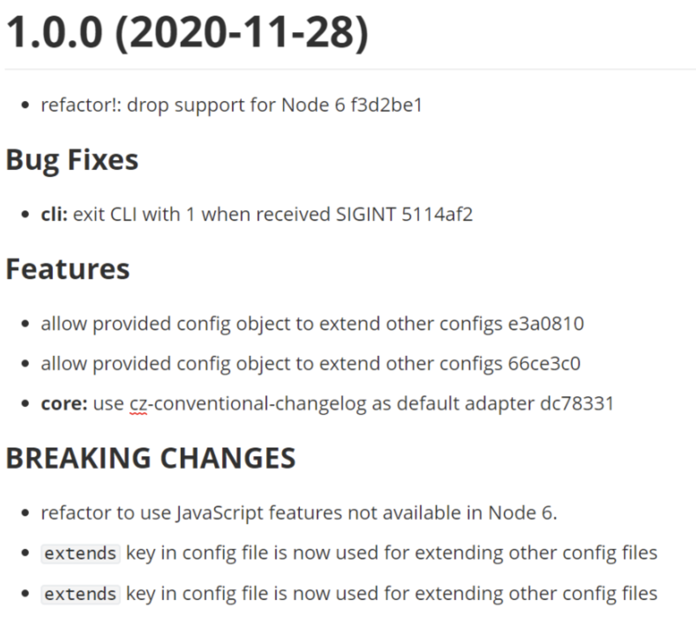

# Git 提交规范

规范的 Commit message 是很有必要的。

- 可以统一团队的 `Git commit` 日志风格
- 方便日后查阅， `Reviewing Code`等
- 可以帮助我们写好 `Changelog`
- 能提升项目的整体质量

## Git Commit 规范

目前规范使用较多的是 Angular 团队得规范，这种规范提供了一中轻量级的的提交历史编写规则，它的内容十分的简单:

它包含了三个部分：Header，Body，Footer

```javascript
// 注意冒号 : 后有空格
<type>(<scope>): <subject>
//  空一行
<body>
// 空一行
<footer>


```

其中，Header 是必需的，Body 和 Footer 可以省略。

```shell
// 例子
feat(auth): add login feature

Implemented the login functionality using OAuth 2.0.
This includes the UI for login and integration with the backend.

BREAKING CHANGE: The authentication module has been refactored,
so existing user sessions might be invalidated.
## 解释：
1. feat(auth): add login feature：
  -	feat 是提交类型（type），表示这是一个新的功能。
  -	(auth) 是影响范围（scope），表明该提交影响的是 auth（身份验证）模块。
  -	add login feature 是简短描述（subject），概括了该提交做了什么。
2. 空一行
3. body（主体）是更详细的描述：
	- 解释了登录功能的实现，包括 OAuth 2.0 的使用以及前后端集成。
4. 空一行
5. footer（页脚）用于写 BREAKING CHANGE 或关联的 Issue：
	- 这里表明这是一个破坏性更改，会影响现有用户的会话状态。

```

## 配置 git 提交规范

Commitizen/cz-cli: 是一个格式化 `commit message` 的工具，可以约束提交者按照制定的规范一步一步的填写 `commit message`。

```shell
pnpm i commitizen --save
```

然后在项目的根目录里， 执行以下的命令，使其支持 `Angular` 的 `commit message` 格式。

```shell
commitizen init cz-conventional-changelog --save --save-exact
```

打开 package.json， 可以看到配置为：

```json
"config": {
  "commitizen": {
    "path": "./node_modules/cz-conventional-changelog"
  }
}
```

之后，只要是用到 `git commit` 命令，一律改为使用 `git cz`， 然后就会出现选项， 用来生成符合格式的 `commit message`

可以看到，`git cz` 给出了 commit 的几种类型选项，如下：

- feat 新功能
- fix Bug 修复
- docs 文档更新
- style 代码的格式，标点符号的更新
- refactor 代码重构
- ...

## Commitizen 校验

约束了一套代码规范提交说明了， 但是还是有人不按照规范提交代码说明怎么呢？， 那么就需要 `commitlint` 来校验 `commit` 了。

- [commitizen](https://github.com/commitizen/cz-cli) ，一款标准化 `git commit` 信息的工具。

```shell
pnpm i --save-dev @commitlint/cli @commitlint/config-conventional


```

然后在项目中新建 `commitlint.config.js`文件，并且设置校验规则：

```javascript
module.exports = {
  extends: ['@commitlint/config-conventional'],
}
```

安装`huksy`（git 钩子工具）

```shell
pnpm i husky --save-dev
```

初始化`huksy`

```shell
# 使用以下命令初始化 Husky。这会为项目创建一个 .husky/ 目录，并添加必要的 Git hooks。
npx husky install

# 添加 commit hook 钩子
# npx husky add .husky/commit-msg  'npx --no -- commitlint --edit ${1}'  # add命令已废弃

# 手动添加 commit hook 钩子
echo "npx --no -- commitlint --edit ${1}" > .husky/commit-msg

```

为了确保其他开发者在克隆项目后也能安装 Husky hooks，你可以在 package.json 中添加 Husky 的安装命令：

```json
{
  "scripts": {
    "prepare": "husky install"
  }
}
```

## git commit 触发 git cz

在提交的时候，我们都习惯了 `git commit` ，虽然换成 `git cz` 不难，但是如果让开发者在 `git commit` 时无感知的触发 `git cz` 肯定是更好的， 而且也能避免不熟悉项目的人直接 `git commit` 提交一些不符合规范的信息。

我们可以在 package.json 中设置：

```javascript
"husky": {
  "hooks": {
    "prepare-commit-msg": "exec < /dev/tty && git cz --hook",
  }
}
```

## 生成 Changelog

效果如下：


使用工具如 **standard-changelog** 或 **auto-changelog** 自动生成 changelog。

### **Standard Changelog**

- 安装：

```js
  pnpm i --save-dev conventional-changelog conventional-changelog-cli
```

- 配置 `package.json`:

```json
  "scripts": {
    "changelog": "conventional-changelog -p angular -i CHANGELOG.md -s -r 0"
  }
```

- 生成 changelog:

```shell
  npm run changelog
```

## 参考

- [git 提交规范及如何配置](https://shuliqi.github.io/2021/01/15/%E5%A6%82%E4%BD%95%E9%85%8D%E7%BD%AEgit%E6%8F%90%E4%BA%A4%E8%A7%84%E8%8C%83/#Git-Commit-%E8%A7%84%E8%8C%83)
- [Commit 规范 + CHANGELOG 生成](https://cloud.tencent.com/developer/article/1755709)
