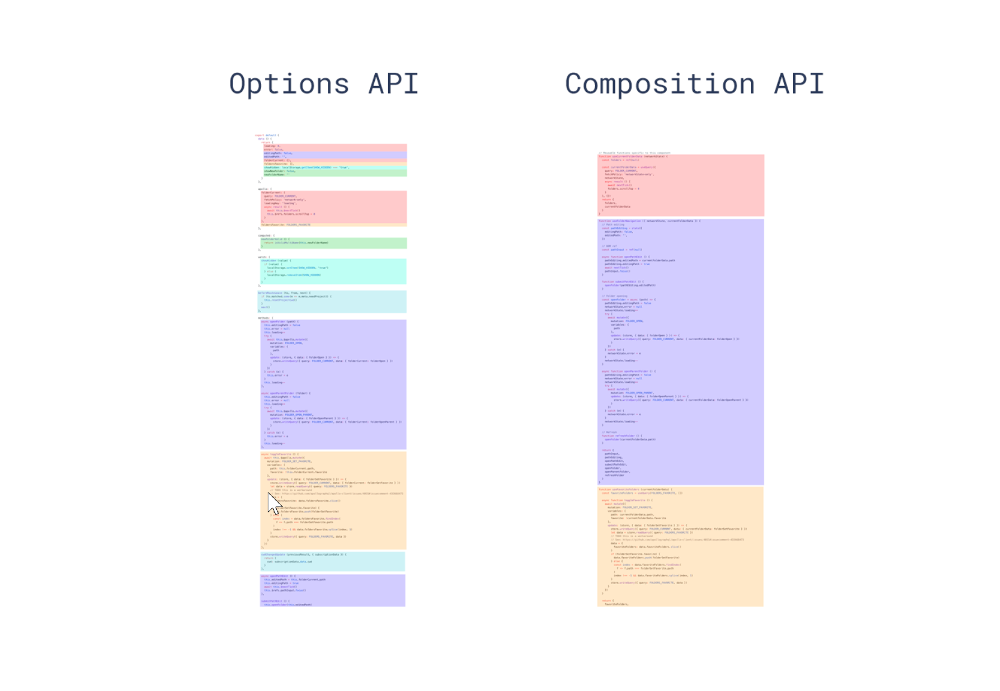

# vue3 代码规范

## 一、组件格式

**所有组件**使用 `SFC` 或 `TSX` 形式编写；

> SFC 允许将 HTML、CSS 和 JavaScript（或 TypeScript）都放在同一个文件中，形成一个单文件组件。这样每个 Vue 组件都是一个独立、模块化的文件。

```html
<template>
  <div>hello world</div>
</template>
<script setup lang="ts">
</script>
<style lang="scss" scoped>
```

> TSX 是在 TypeScript 中使用 JSX 的一种扩展格式，通常在 React 中使用。JSX 是 JavaScript 的语法扩展，允许在 JavaScript/TypeScript 中编写类似 HTML 的代码，这种形式通常用于 React 组件的视图层描述。

```tsx
import { defineComponent } from 'vue'

const HelloWorld = defineComponent({
  props: {
    msg: {
      type: String,
      required: true,
    },
  },
  setup(props) {
    return () => (
      <div>
        <h1>{props.msg}</h1>
        <button onClick={() => alert('Button clicked!')}>Click Me!</button>
      </div>
    )
  },
})

export default HelloWorld
```

## 二、Vue 项目规范

### 2.1、目录规范

```markdown
src 源码目录
|-- build 构建相关
|-- api 所有 api 接口
| | -- sign.ts 加解密规则
| | -- index.ts 封装 axios
| | -- module
| | | -- user.ts 封装 user api
| | -- interface
| | | -- user.ts 定义 user api 接口
|-- assets 静态资源，images, icons, styles 等
|-- components 公用组件
|-- config 配置信息 全局默认配置项
|-- constants 常量信息，项目所有 Enum, 全局常量等
| | -- index-const.ts 索引常量
| | -- role-const.ts 角色常量
| | -- employee-const.ts 员工常量
|-- directives 自定义指令
|-- lib 外部引用的插件存放及修改文件
|-- i18n 国际化
|-- mock 模拟接口，临时存放
|-- plugins 插件，全局使用
|-- router 路由，统一管理
|-- store 状态，统一管理
| |-- index.ts 导出 store
| |-- modules
| | |-- user.ts 定义 user store
|-- layout 布局，自定义样式主题
|-- utils 工具类
|-- views 视图目录
| |-- role role 模块
| |-- |-- index.less role 模块样式
| |-- |-- components role 模块通用组件文件夹
| |-- |-- | -- RoleList.vue role 列表页面
| |-- |-- | -- RoleAdd.vue role 新建页面
| |-- |-- | -- RoleUpdate.vue role 更新页面
| |-- |-- index.vue role 模块入口文件
| |-- employee employee 模块
```

### 2.2、 api 目录

- `api`文件要以 `api` 为结尾，比如 `employee-api.js`、`login-api.js`，方便查找。
- `api`文件必须导出对象必须以 `Api` 为结尾，如：`departmentApi`、`noticeApi`
- `api`中以一个对象将方法包裹
- `api`中的注释，必须和后端 `swagger` 文档保持一致，同时保留后端作者

```js
// department-api.js

import { getRequest, postRequest } from '@/api'

export const departmentApi = {
  /**
   * @description: 查询部门列表 @author 轻语
   * @param {*}
   * @return {*}
   */
  queryAllDepartment: () => {
    return getRequest('/department/listAll')
  },

  /**
   * @description: 查询部门树形列表 @author 轻语
   * @param {*}
   * @return {*}
   */
  queryDepartmentTree: () => {
    return getRequest('/department/treeList')
  },

  /**
   * @description: 添加部门 @author 轻语
   * @param {*}
   * @return {*}
   */
  addDepartment: (param) => {
    return postRequest('/department/add', param)
  },
  /**
   * @description: 更新部门信息 @author 轻语
   * @param {*}
   * @return {*}
   */
  updateDepartment: (param) => {
    return postRequest('/department/update', param)
  },
}
```

### 2.3、 assets 目录

assets 为静态资源，里面存放 images, styles, icons 等静态资源，静态资源命名格式为 kebab-case

```
|assets
|-- icons
|-- images
|   |-- background-color.png
|   |-- upload-header.png
|-- styles
```

### 2.4、 components 目录

此目录应按照组件进行目录划分，目录命名为 `(PascalCase)`，一个组件必须一个单独的目录 ；

```
components/
  |- MyComponent
  |  |- index.vue
  |  |- index.less
  |  |- MyChildComponent
  |  |  |- index.vue
  |  |  |- index.less
  |- MyOtherComponent
  |  |- index.vue
  |  |- index.less
```

### 2.5、 constants 目录

此目录存放项目所有常量和枚举:

- 文件命名： 常量文件要以 `const` 为结尾，比如 login-const.js、file-const.js
- 变量命名：
  - 大写下划线，比如 LOGIN_RESULT_ENUM、LOGIN_SUCCESS、LOGIN_FAIL
  - 如果是枚举，变量必须以 `ENUM` 为结尾，如：LOGIN_RESULT_ENUM、CODE_FRONT_COMPONENT_ENUM

目录结构：

```
|constants
|-- index-const.js
|-- role-const.js
|-- employee-const.js
```

```js
// employee-const.js
export const EMPLOYEE_STATUS = {
  NORMAL: {
    value: 1,
    desc: '正常',
  },
  DISABLED: {
    value: 1,
    desc: '禁用',
  },
  DELETED: {
    value: 2,
    desc: '已删除',
  },
}

export const EMPLOYEE_ACCOUNT_TYPE = {
  QQ: {
    value: 1,
    desc: 'QQ登录',
  },
  WECHAT: {
    value: 2,
    desc: '微信登录',
  },
  DINGDING: {
    value: 3,
    desc: '钉钉登录',
  },
  USERNAME: {
    value: 4,
    desc: '用户名密码登录',
  },
}

export default {
  EMPLOYEE_STATUS,
  EMPLOYEE_ACCOUNT_TYPE,
}
```

### 2.6、 router 与 store 目录

这两个目录一定要将业务进行拆分，不能放到一个 `js` 文件里。

- `router` 尽量按照 `views` 中的结构保持一致

- `store` 按照业务进行拆分不同的 `js` 文件

## 三、Vue3 组合式 API 规范

### 3.1、使用 setup 语法糖

**所以组件**必须使用`setup`语法糖。

### 3.2、组合式 Composition API 规范

组合式 Api，即 `Composition API` ，解决的是让相互关联的代码在一起，以更方便的组织代码：

```vue
<script setup>
import { ref, reactive } from 'vue'
import { message } from 'ant-design-vue'
import { SmartLoading } from '/@/components/framework/smart-loading'
import _ from 'lodash'
import { categoryApi } from '/@/api/business/category/category-api'
import { smartSentry } from '/@/lib/smart-sentry'

// emit
const emit = defineEmits('reloadList')

//  组件
const formRef = ref()

// ------------------------------ 显示 、隐藏操作的 变量和方法------------------------------

// 是否展示抽屉
const visible = ref(false)
// 显示
function showModal(categoryType, parentId, rowData) {
  Object.assign(form, formDefault)
  form.categoryType = categoryType
  form.parentId = parentId
  if (rowData && !_.isEmpty(rowData)) {
    Object.assign(form, rowData)
  }
  visible.value = true
}
// 隐藏
function onClose() {
  Object.assign(form, formDefault)
  visible.value = false
}

// ------------------------------ 表单的  变量和方法 ------------------------------
// 查询表单默认值
const formDefault = {
  categoryId: undefined, //分类id
  categoryName: '', //分类名字
  categoryType: 1, // 分类类型
  parentId: undefined, // 父级id
  disabledFlag: false, //是否禁用
}
// 查询表单
let form = reactive({ ...formDefault })
// 表单校验规则
const rules = {
  categoryName: [{ required: true, message: '请输入分类名称' }],
}

function onSubmit() {
  formRef.value
    .validate()
    .then(async () => {
      SmartLoading.show()
      try {
        if (form.categoryId) {
          await categoryApi.updateCategory(form)
        } else {
          await categoryApi.addCategory(form)
        }
        message.success(`${form.categoryId ? '修改' : '添加'}成功`)
        emit('reloadList', form.parentId)
        onClose()
      } catch (error) {
        smartSentry.captureError(error)
      } finally {
        SmartLoading.hide()
      }
    })
    .catch((error) => {
      console.log('error', error)
      message.error('参数验证错误，请仔细填写表单数据!')
    })
}

defineExpose({
  showModal,
})
</script>
```



### 3.3、模板引用变量 Ref

对于 vue3 中的模板引用 ref，即 ref 是作为一个特殊的 attribute

```html
<input ref="inputRef" />
```

- 使用 ref 方法，参数为空 进行声明变量
- 变量必须以 Ref 为结尾
- template 中的 ref 也必须以 Ref 为结尾
  比如上面的例子，声明如下

```vue
const inputRef = ref();
```

### 3.4 注释

- 对于业务函数，即函数中有多个业务逻辑，需逐一注释。

```js
const login = (formEl: FormInstance | undefined) => {
  if (!formEl) return
  formEl.validate(async (valid) => {
    if (!valid) return
    loading.value = true
    try {
      // 1.执行登录接口
      const { data } = await loginApi.login({ ...loginForm, password: md5(loginForm.password) })
      userStore.setToken(data.access_token)

      // 2.添加动态路由
      await initDynamicRouter()

      // 3.清空 tabs、keepAlive 数据
      tabsStore.setTabs([])
      keepAliveStore.setKeepAliveName([])

      // 4.跳转到首页
      router.push(HOME_URL)
    } finally {
      loading.value = false
    }
  })
}
```
